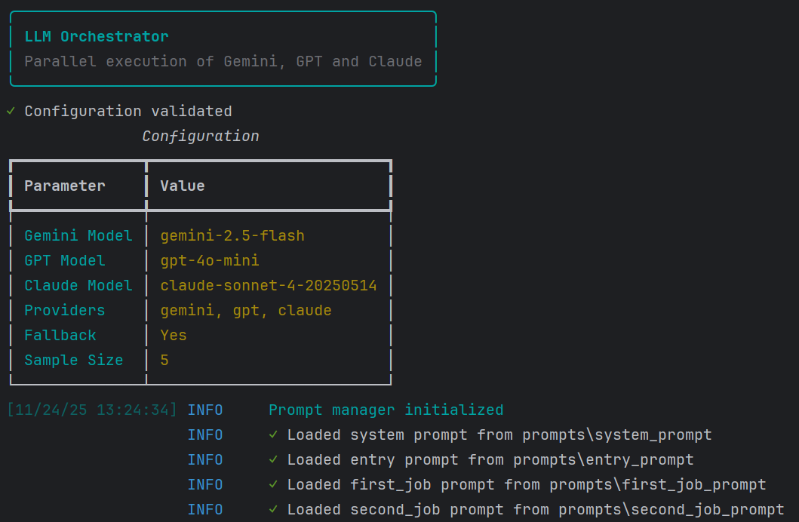

# DACSERT: Default And Common Sense Evaluator for Reasoning Tasks

[](LICENSE)
[](README.md)

DACSERT (Default And Common Sense Evaluator for Reasoning Tasks) is an **Asynchronous Orchestrator** built on Python and LangChain, designed to execute parallel calls to various Large Language Models (LLMs) such as **Gemini, GPT, and Claude**. Its core purpose is to evaluate their reasoning capabilities, specifically differentiating between **Common Sense** and **Default Reasoning**, based on a structured dataset.

The project manages complex prompts (`System`, `Entry`, `First Job`, `Second Job`) and includes robust result extraction mechanisms and error handling (including a **fallback** mode).

---

## ✨ Key Features

* **⚡ Parallel Execution:** Uses `asyncio` and `LangChain` to query multiple LLMs simultaneously.
* **🧠 Prompt Management:** Dedicated `PromptManager` for loading, validating, and formatting complex prompt templates.
* **✂️ Robust Data Extraction:** The `extractors.py` module uses regular expressions to parse the structured output from the LLMs.
* **🛡️ Error Handling:** Supports `fallback` to ensure processing continues even if individual provider calls fail.
* **💻 CLI Interface:** Employs `Typer` and **Rich** for a clean, configurable, and visually appealing command-line interface.
* **📊 Detailed Output:** Structured logging of results (inferences, used/not used reasoning, explanations) into a CSV file.
* **📦 Packaging:** Dependency management is handled by **Poetry**.

---

## 📚 Dataset and References

This orchestrator was initially developed and tested using a custom version of the **Atomic** dataset (`v4_atomic_all.csv`).

### Atomic Dataset Reference

The project draws on concepts related to the **Atomic** knowledge graph, which focuses on machine common sense and inferential knowledge.

* **Hugging Face Dataset Link:**
    > `https://huggingface.co/datasets/conceptnet/atomic`
* **Original Paper Reference:**
    > Hwang, J., Choi, E., Brass, P., Vostyakova, A., Zellers, R., & Choi, Y. (2021). **ATOMIC: An Atlas of Machine Comonsense for If-Then Reasoning**. *Thirty-Fifth AAAI Conference on Artificial Intelligence*.

### Adaptability

The system is highly **adaptable**. While currently tailored to the Atomic data structure and its specific reasoning tasks (Common Sense vs. Default Reasoning), you can adapt DACSERT to evaluate LLMs on **any structured reasoning dataset** by modifying the prompt files (`prompts/`) and the data extraction logic in `extractors.py`.

---

## 🛠️ Installation

The project uses **Poetry** for dependency management.

### Prerequisites

* Python 3.10+
* Poetry

### 1. Clone the Repository

```bash
git clone [https://github.com/your-username/DACSERT.git](https://github.com/your-username/DACSERT.git)
cd DACSERT
```

### 2. Configure the Environment
Install dependencies using Poetry:

```bash
poetry install
```

### 3. API Keys
The project requires API keys for the LLM services. Create a .env file in the root directory and add your keys:
```Ini, TOML
# .env file
GEMINI_KEY="YOUR_GEMINI_API_KEY"
OPENAI_KEY="YOUR_OPENAI_API_KEY"
CLAUDE_KEY="YOUR_CLAUDE_API_KEY"
```
## ⚙️ Usage
The project is executed via the typer command defined in llm_orchestrator.py.
### Standard Execution
Run the orchestrator with default settings (samples to process: 1, providers: gemini, gpt, claude, fallback: Yes):
```bash
poetry run python core/llm_orchestrator.py run
```
### Command-Line Options
You can customize the execution using various flags:
| Flag (Short/Long) | Description | Default |
| :--- | :--- | :--- |
| `-d / --data` | Path to the input dataset CSV file. | `../dataset/v4_atomic_all.csv` |
| `-o / --output` | Path to the output CSV file for results. | `../responses/llm_responses.csv` |
| `-p / --provider` | LLM providers to use (e.g., `gemini`, `gpt`, `claude`). | `gemini, gpt, claude` |
| `-n / --samples` | Number of samples to process from the dataset. | `1` |
| `--fallback/--no-fallback` | Enables/Disables fallback mode upon provider failure. | `True` |
| `--gemini-model` | Specifies the Gemini model to use. | `gemini-2.5-flash` |
| `--gpt-model` | Specifies the GPT model to use. | `gpt-4o-mini` |
| `--claude-model` | Specifies the Claude model to use. | `claude-sonnet-4-20250514` |

Example: Run on 100 samples, using only Gemini and GPT, without fallback:
```bash
poetry run python core/llm_orchestrator.py run -n 100 -p gemini -p gpt --no-fallback
```

### 🖼️ Execution Example
The program uses the Rich library to provide a clear, real-time view of the configuration loading, prompt status, and parallel execution.

#### Configuration and Prompt Loading:

#### Parallel Execution Status:


## 📂 Project Structure
The project structure is organized into a core directory for the main logic and separate directories for data, prompts, and output.
```
DACSERT/
├── core/
│   ├── llm_orchestrator.py      # Main entry point, LangChain Orchestrator, Typer CLI
│   ├── extractors.py             # Parsing/extraction functions from LLM output (RegEx)
│   └── opinions_questioner.py    # Utility for a separate task related to optional prompting/changing opinions
├── dataset/                      # Directory for input data
│   └── v4_atomic_all.csv         # Example dataset file
├── images/                       # Placeholder for documentation images
├── prompts/                      # Directory for prompt files
│   ├── system_prompt             # System prompt for LLMs
│   ├── entry_prompt              # Prompt for inserting dataset JSON
│   ├── first_job_prompt          # Instructions for the 'First Job' (Inference & Reasoning)
│   ├── second_job_prompt         # Instructions for the 'Second Job' (Common Sense vs Default Reasoning)
│   └── optional_prompt           # Prompt for the optional task (changing opinions)
└── responses/                    # Directory for output data
    ├── llm_responses.csv         # Main CSV output file
    └── changing_opinions.csv     # CSV output for the optional task
```

## 🤝 Contributing
Contributions are welcome! If you find a bug or have suggestions, please open an Issue or submit a Pull Request.

## 📄 License
This project is licensed under the **GPL** License. See the LICENSE file for more details.
